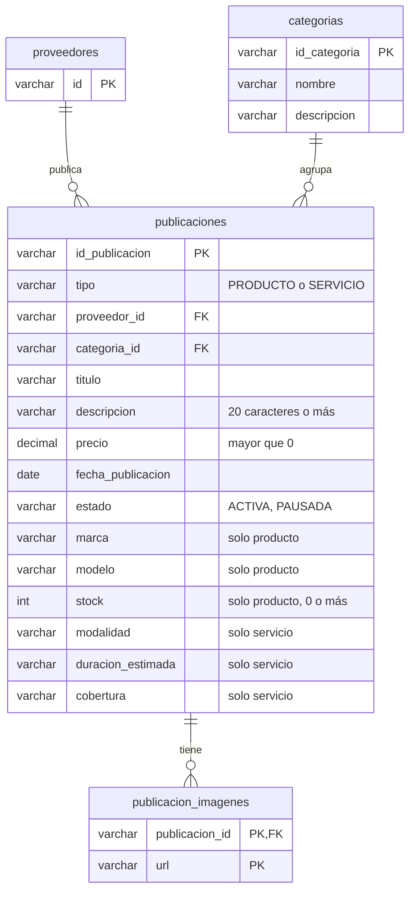
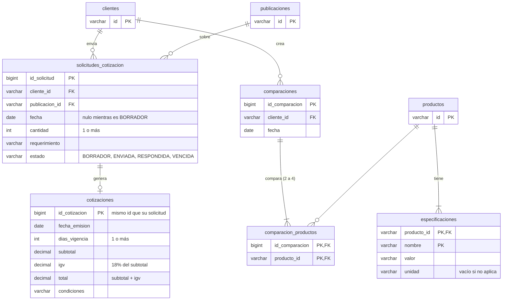

# Modelo de datos

Tablas de cada módulo según el diagrama de clases del equipo. En este avance **no hay base de datos**: los datos
viven en repositorios en memoria (`infrastructure/persistence/memory`). Este modelo es el que tomarán las tablas
cuando se conecte MySQL con Spring Data.

En cada diagrama, las tablas de otros módulos solo muestran las columnas que se referencian.

## Catálogo (`catalogo/`, Carlos)

`Publicacion` es abstracta y se guarda en una sola tabla con la columna `tipo` (`PRODUCTO` o `SERVICIO`): las
columnas propias de cada subclase quedan vacías en la otra.

| Clase (dominio) | Tipo | Tabla | Repositorio en memoria |
|---|---|---|---|
| `Publicacion` | Aggregate abstracto | `publicaciones` | `InMemoryPublicacionRepository` |
| `Producto` | Hereda de `Publicacion` | `publicaciones` (`tipo = PRODUCTO`) | El mismo |
| `Servicio` | Hereda de `Publicacion` | `publicaciones` (`tipo = SERVICIO`) | El mismo |
| `Categoria` | Aggregate | `categorias` | `InMemoryCategoriaRepository` |

`listarPublicaciones()` de `Categoria` es `PublicacionRepository.findByCategoriaId(...)`.

## Cotizaciones y comparador (`cotizaciones/`, Esteban)

| Clase (dominio) | Tipo | Tabla | Repositorio en memoria |
|---|---|---|---|
| `SolicitudCotizacion` | Aggregate | `solicitudes_cotizacion` | `InMemorySolicitudCotizacionRepository` |
| `Cotizacion` | Entity dentro de la solicitud | `cotizaciones` | Se guarda con su solicitud |
| `Comparacion` | Aggregate | `comparaciones` + `comparacion_productos` | `InMemoryComparacionRepository` |
| `Especificacion` | Entity del producto | `especificaciones` | `InMemoryEspecificacionRepository` |
