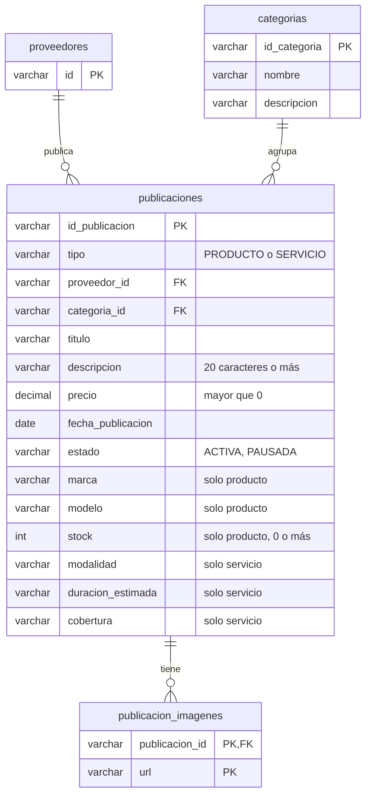
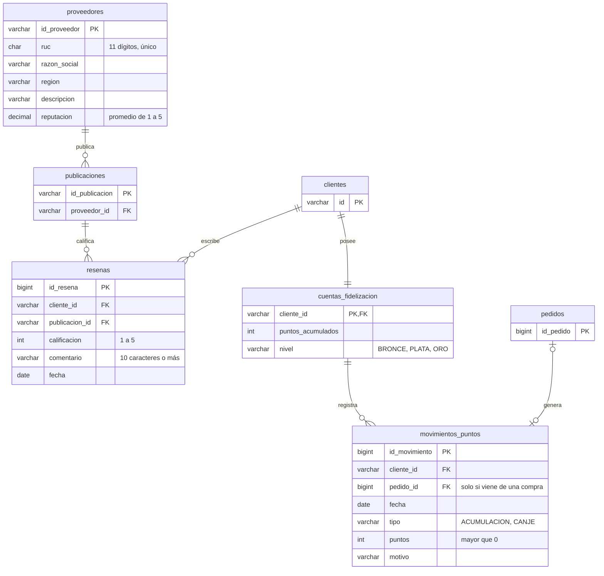
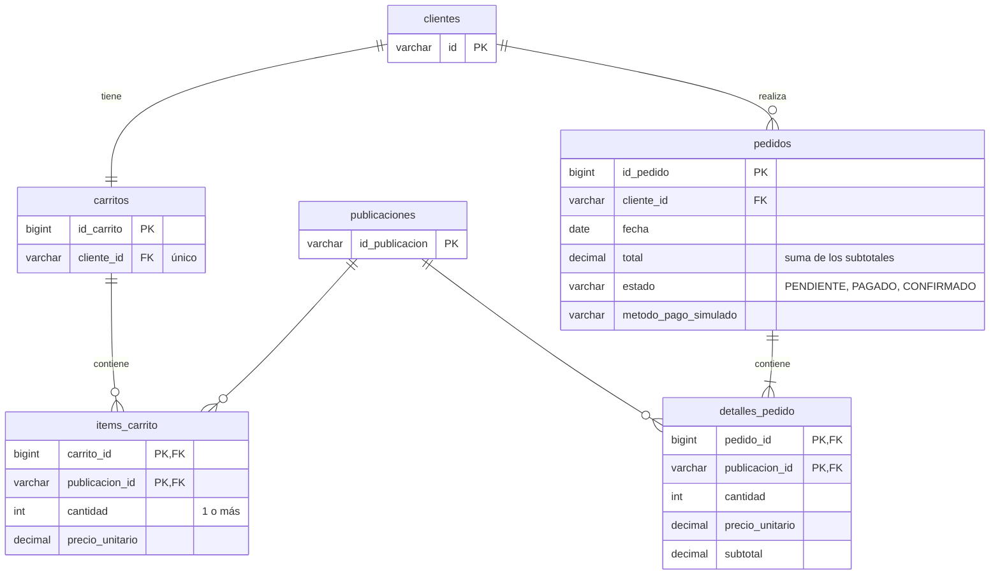
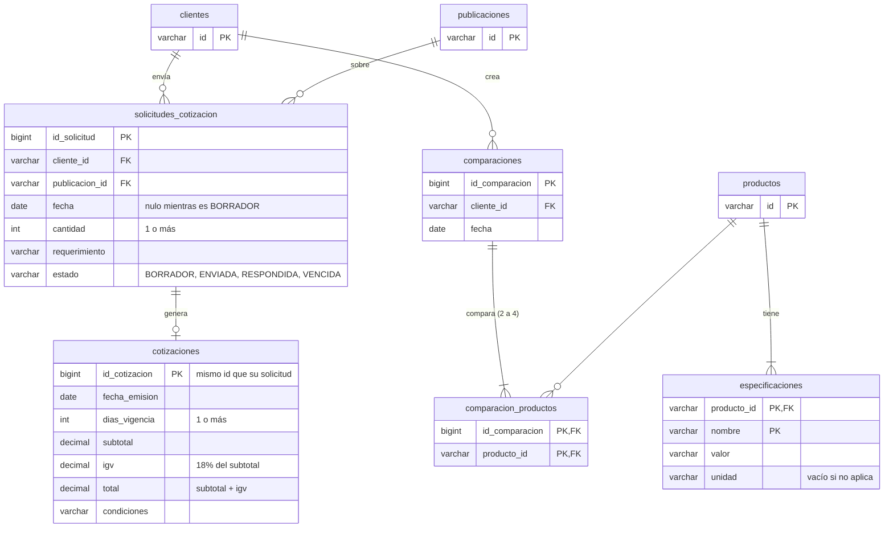

# Modelo de datos

Tablas de cada módulo según el diagrama de clases del equipo. En este avance **no hay base de datos**: los datos
viven en repositorios en memoria (`infrastructure/persistence/memory`). Este modelo es el que tomarán las tablas
cuando se conecte MySQL con Spring Data.

En cada diagrama, las tablas de otros módulos solo muestran las columnas que se referencian.

## Catálogo (`catalogo/`, Carlos)

`Publicacion` es abstracta y se guarda en una sola tabla con la columna `tipo` (`PRODUCTO` o `SERVICIO`): las
columnas propias de cada subclase quedan vacías en la otra.

| Clase (dominio) | Tipo | Tabla | Repositorio en memoria |
|---|---|---|---|
| `Publicacion` | Aggregate abstracto | `publicaciones` | `InMemoryPublicacionRepository` |
| `Producto` | Hereda de `Publicacion` | `publicaciones` (`tipo = PRODUCTO`) | El mismo |
| `Servicio` | Hereda de `Publicacion` | `publicaciones` (`tipo = SERVICIO`) | El mismo |
| `Categoria` | Aggregate | `categorias` | `InMemoryCategoriaRepository` |

`listarPublicaciones()` de `Categoria` es `PublicacionRepository.findByCategoriaId(...)`.

## Proveedor, reseñas y fidelización (`proveedores/` y `fidelizacion/`, Esperanza)

La reputación del proveedor es el promedio de las calificaciones de las reseñas de sus publicaciones. El saldo de la
cuenta sale de sus movimientos: una acumulación suma y un canje resta. El nivel depende del saldo
(BRONCE menos de 500, PLATA desde 500, ORO desde 1500).

| Clase (dominio) | Tipo | Tabla | Repositorio en memoria |
|---|---|---|---|
| `Proveedor` | Aggregate | `proveedores` | `InMemoryProveedorRepository` |
| `Resena` | Aggregate | `resenas` | `InMemoryResenaRepository` |
| `CuentaFidelizacion` | Aggregate | `cuentas_fidelizacion` | `InMemoryCuentaFidelizacionRepository` |
| `MovimientoPuntos` | Entity dentro de la cuenta | `movimientos_puntos` | Se guarda con su cuenta |

Una reseña por cliente y por publicación (`existsByClienteIdAndPublicacionId`).

## Compra simulada (`compras/`, Leyla)

Cada cliente tiene un solo carrito. Al comprar, cada ítem del carrito pasa a ser un detalle del pedido con el
precio de ese momento. El pago es simulado: no hay pasarela.

| Clase (dominio) | Tipo | Tabla | Repositorio en memoria |
|---|---|---|---|
| `Carrito` | Aggregate | `carritos` | `InMemoryCarritoRepository` |
| `ItemCarrito` | Entity dentro del carrito | `items_carrito` | Se guarda con su carrito |
| `Pedido` | Aggregate | `pedidos` | `InMemoryPedidoRepository` |
| `DetallePedido` | Entity dentro del pedido | `detalles_pedido` | Se guarda con su pedido |

## Cotizaciones y comparador (`cotizaciones/`, Esteban)

| Clase (dominio) | Tipo | Tabla | Repositorio en memoria |
|---|---|---|---|
| `SolicitudCotizacion` | Aggregate | `solicitudes_cotizacion` | `InMemorySolicitudCotizacionRepository` |
| `Cotizacion` | Entity dentro de la solicitud | `cotizaciones` | Se guarda con su solicitud |
| `Comparacion` | Aggregate | `comparaciones` + `comparacion_productos` | `InMemoryComparacionRepository` |
| `Especificacion` | Entity del producto | `especificaciones` | `InMemoryEspecificacionRepository` |
