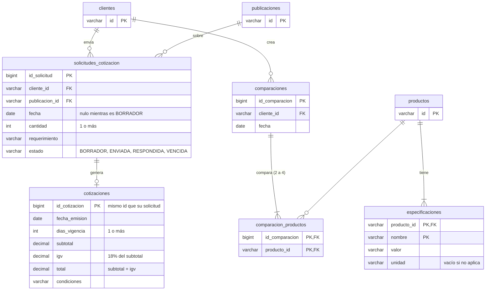

# Modelo de datos: cotizaciones y comparador

Tablas del módulo `cotizaciones/` según el diagrama de clases del equipo. En este avance **no hay base de datos**:
los datos viven en repositorios en memoria (`infrastructure/persistence/memory`). Este modelo es el que tomarán las
tablas cuando se conecte MySQL con Spring Data.

`clientes`, `publicaciones` y `productos` son de otros módulos (usuarios y catálogo); aquí solo se muestran las
columnas que se referencian.

## De clase a tabla

| Clase (dominio) | Tipo | Tabla | Repositorio en memoria |
|---|---|---|---|
| `SolicitudCotizacion` | Aggregate | `solicitudes_cotizacion` | `InMemorySolicitudCotizacionRepository` |
| `Cotizacion` | Entity dentro de la solicitud | `cotizaciones` | Se guarda con su solicitud |
| `Comparacion` | Aggregate | `comparaciones` + `comparacion_productos` | `InMemoryComparacionRepository` |
| `Especificacion` | Entity del producto | `especificaciones` | `InMemoryEspecificacionRepository` |
